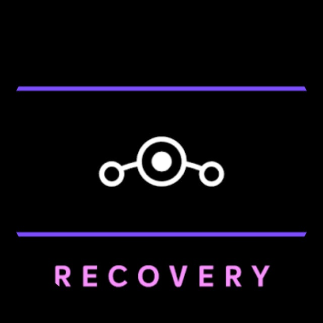
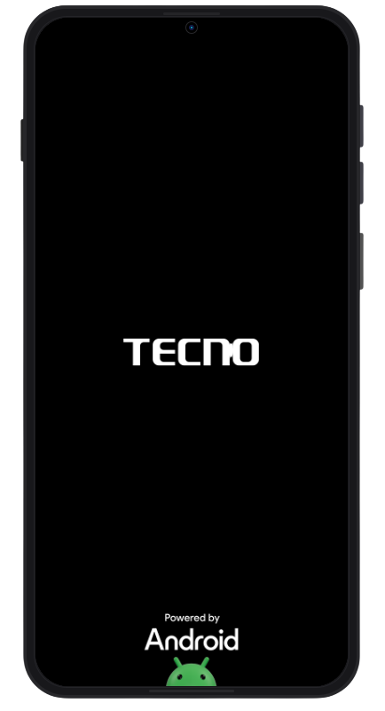
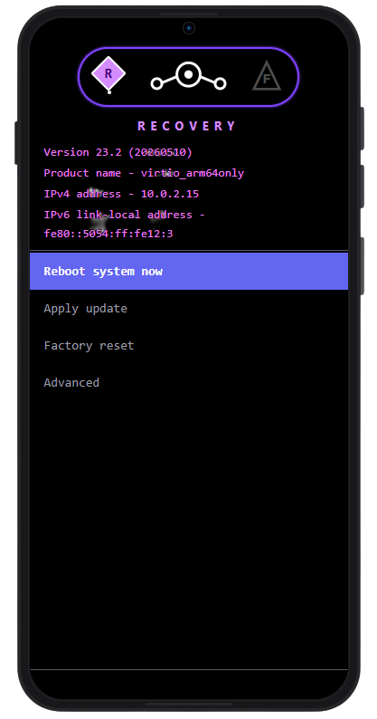
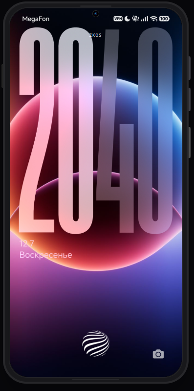
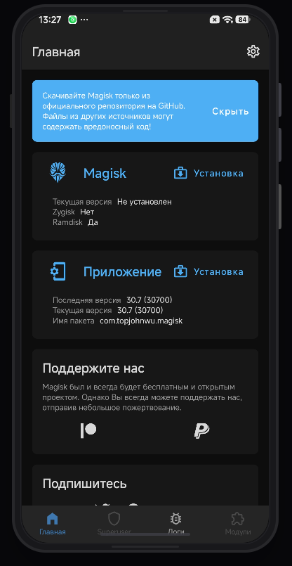
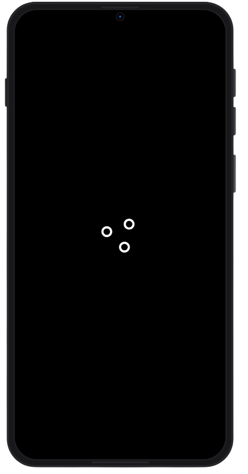
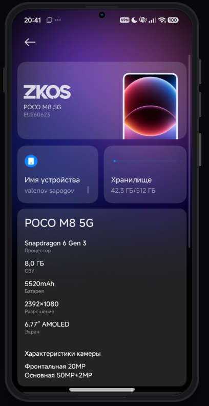
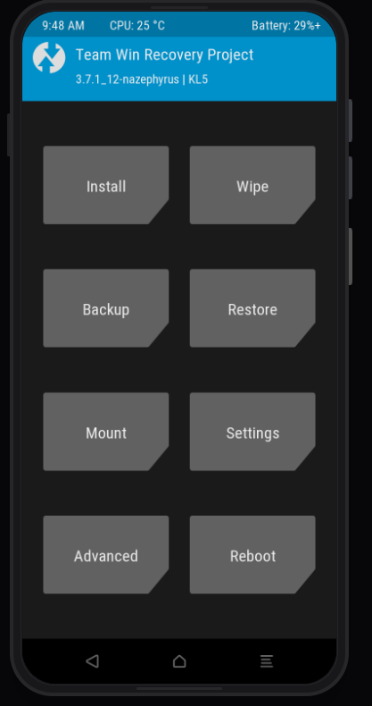

<div align="right">
  <a href="./README.md"></a>
  <a href="./README_RU.md"></a>
</div>

<div align="center">
  
  <h1>LRP</h1>
  <p><b>Lineage Recovery Platform</b></p>
</div>

[]([https://github.com/UralRedux/LRP/releases/latest](https://github.com/limex-ai/lineageOS-Recovery/releases/tag/1.1.0))


LRP — это веб-эмулятор, воспроизводящий интерфейс AOSP-прошивки **LineageOS** и фирменной среды восстановления **Lineage Recovery**.

Проект представляет собой единую виртуальную экосистему смартфона, позволяющую запускать виртуальное устройство прямо в браузере.

## Совместимость

| | Требования |
|-----------------|----------------|
| `Node.js` | `20+` |
| `npm` | `10+` |
| `Browser` | `Chrome / Edge / Firefox` |

---

## Установка

### 1. Установите Node.js

Скачайте последнюю LTS-версию:

https://nodejs.org

### 2. Клонируйте репозиторий

```bash
git clone https://github.com/UralRedux/LRP.git
```

### 3. Перейдите в папку проекта

```bash
cd LRP
```

### 4. Установите зависимости

```bash
npm install
```

### 5. Запустите проект

```bash
npm run dev
```

После запуска откройте ссылку, которую покажет терминал (обычно `http://localhost:5173`).

---

## Возможности

- Полная эмуляция интерфейса LineageOS
- Эмуляция Lineage Recovery
- Виртуальная файловая система
- Настройки устройства
- Анимации загрузки
- Имитация OTA-обновлений
- Работа полностью в браузере
- Современный интерфейс

---

## Скриншоты

<p align="center">
  
  
  
</p>

<p align="center">
  
  
  
</p>

<p align="center">
  
</p>

---

## Контакты

[](https://t.me/lineageOS_recovery)

Новости проекта, обновления, поддержка и обсуждение LRP.

---

## Лицензия

MIT License

> [!NOTE]
> LRP не является настоящей прошивкой Android. Это веб-эмулятор интерфейса LineageOS и Lineage Recovery, предназначенный для демонстрации, тестирования и разработки.
